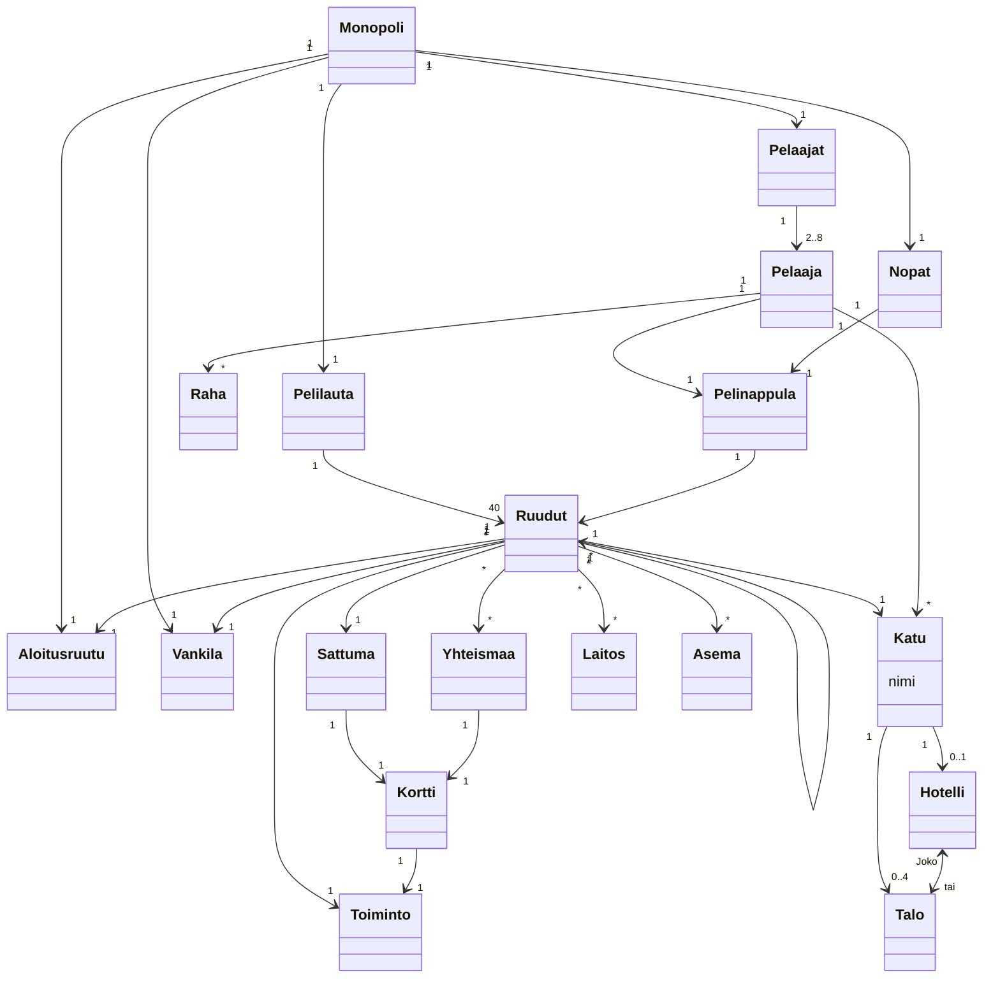

```mermaid
 classDiagram
      Monopoli "1" --> "1" Pelaajat  
      Pelaajat "1" --> "2..8" Pelaaja
      Monopoli "1" --> "1" Pelilauta
      Pelilauta "1" --> "40" Ruudut
      Ruudut "1" --> "1" Ruudut
      Pelinappula "1" --> "1" Ruudut
      Pelaaja "1" --> "1" Pelinappula
      Monopoli "1" --> "1" Nopat
      Monopoli "1" --> "1" Aloitusruutu
      Monopoli "1" --> "1" Vankila
      Nopat "1" --> "1" Pelinappula
      Ruudut "1" --> "1" Aloitusruutu
      Ruudut "*" -->  "*" Yhteismaa
      Ruudut "*" -->  "1" Sattuma
      Ruudut "1" --> "1" Vankila
      Ruudut "*" -->  "1" Katu
      Ruudut "*" --> "*" Laitos            
      Ruudut "*" --> "*" Asema            
      Ruudut "1" --> "1" Toiminto
      Katu "1" --> "0..1" Hotelli
      Katu "1" --> "0..4" Talo 
      Sattuma "1" --> "1" Kortti
      Yhteismaa "1" --> "1" Kortti
      Kortti "1" --> "1" Toiminto 
      Pelaaja "1" --> "*" Raha    
      Pelaaja "1" --> "*" Katu  
      Hotelli "Joko" <--> "tai" Talo
      class Katu{
        nimi
      }      
```