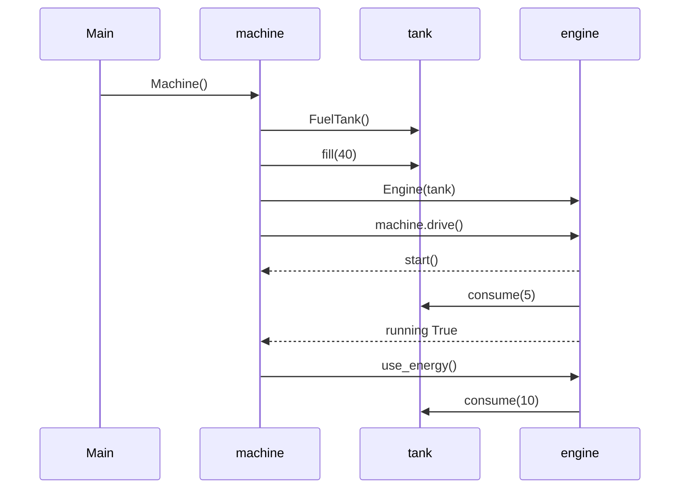

```mermaid
sequenceDiagram
    participant Main
    participant machine
    participant tank
    participant engine    
    Main ->> machine:  Machine()
    machine ->> tank: FuelTank()
    machine ->> tank: fill(40)
    machine ->> engine: Engine(tank)
    machine ->> engine: machine.drive() 
    engine -->> machine: start()
    engine ->> tank: consume(5)
    engine -->> machine: running True
    machine ->> engine: use_energy()
    engine ->> tank: consume(10)
```
    
