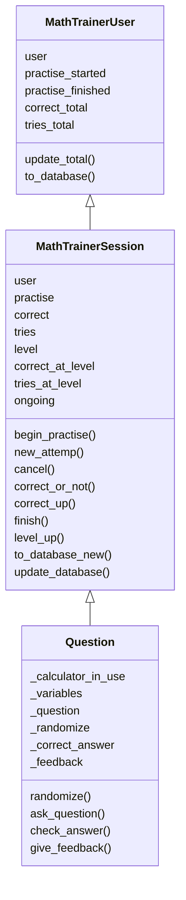
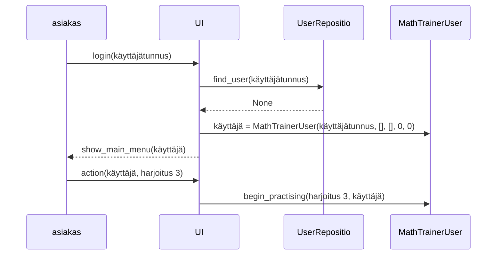
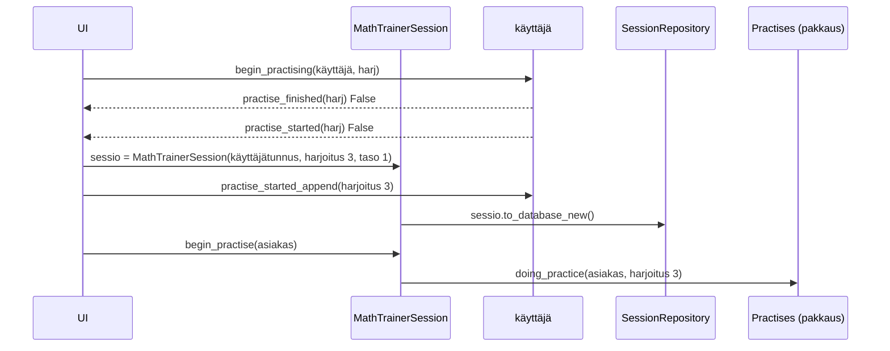
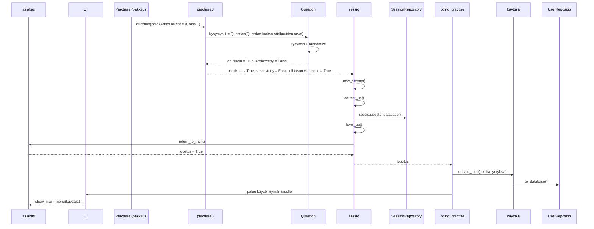

# Arkkitehtuurikuvaus

## Rakenne

Koodin pakkausrakenne on seuraava:

> .  
> ├── entities  
> │  
> ├── practises  
> │   └── practises3_questions  
> │  
> ├── repositories  
> │  
> ├── services  
> │  
> └── ui  

Ohjelman rakenne ei valitettavasti noudata puhdasoppisesti kolmitasoista kerrosarkkitehtuuria ja huomioiden koodin laajuuden ja käytettävissä olevan ajan tätä ei ehdi korjaamaan: Pakkaus UI sisältää käyttöliittymästä vastaavan koodin ja pakkaus repositories tietojen tallennuksesta ja hausta tietokannoista vastaavan koodin. Pakkaus entities sisältää kuitenkin sovelluksen käyttämien luokkien MathTrainerUser, MathTrainerSession ja Question metodeina sovelluslogiikan ytimen. Pakkaus services sisältää sekalaisia apuohjelmia. Sovelluksen varsinaisen sisällön määräävät harjoitukset ovat pakkauksessa practises. Uudessa tavassa laatia harjoitus (nyt harjoitus 3) harjoitukseen liittyvät kysymykset ovat omassa pakkauksessa (nyt practises3_questions).

## Käyttöliittymä

Käyttöliittymä sisältää kolme erillistä päänäkymää:
* Kirjautuminen    
* Toimenpiteen, erityisesti esimerkiksi harjoituksen, valitseminen   
* Toimenpiteen 'ylläpito' valinnalla aukeava valikko tilastotietojen tulostamista varten   

Lisäksi jokaista harjoitusta kohden avautuu oma näkymä. (Nyt neljä.)

Tällä hetkellä käyttöliittymä on tekstipohjainen.

## Sovelluslogiikka

Sovelluksessa on usean tasoista sovelluslogiikkaa. Jokaista harjoitusta vastaa oma harjoitukselle ominainen sovelluslogiikka.

Sovelluksen rungon loogisen tietomallin muodostavat luokat MathTrainerUser ja MathTrainerSession. Näistä ensimmäinen kuvaa käyttäjää ja hänen tekemiensä harjoitusten kokonaistilannetta. Jälkimmäinen kuvaa käyttäjän tekemän yksittäisen harjoituksen yksittäiseen tasoon liittyviä tietoja. Harjoituksen 3 (joka edustaa tapaa, joka tulee olemaan jatkossa käytössä harjoituksia lisättäessä) sovelluslogiikasta vastaa luokka Question. Alla kaaviokuva näistä (vain oleellisemmat metodit mainittu):

Luokan MathtrainerUser attribuuttien arvoina on käyttäjän tunnus, listat aloitetuista sekä niistä loppuun tehdyistä harjoituksista ja käyttäjän oikeiden vastausten ja yritysten lukumääristä kaikissa harjoituksissa yhteensä.

Luokan MathTrainerSession attribuuttien arvoina on käyttäjän tunnus, harjoituksen numero, taso, jolle käyttäjä on edennyt kyseisessä harjoituksessa ja tieto siitä, kuinka monta oikeaa vastausta ja yritystä käyttäjällä on toisaalta koko harjoituksessa, toisaalta menossa olevalla tasolla.

Luokan Question metodi randomize() antaa kysymyksen parametreille (_variables) attribuutin _randomize arvona olevan funktion mukaiset arvot. 

Attribuutti _ question on sanakirja,jonka avaimet ovat 'text', 'prompt' ja 'mode'. question['text'] sisältää tehtävän kysymyksen sen muuttujien funktiona, question['prompt'] on kehote vastauksen antamiseen ja 'mode' kertoo, minkä tyyppisiä vastauksia kysymykseen odotetaan.

Metodi ask_question() esittää tehtävän näitä hyödyntäen. 

Metodi check_answer() tarkistaa vastauksen oikeellisuuden hyödyntäen attribuutin _correct_answer arvona olevaa funktiota, joka laskee oikean vastauksen tehtävän parametrien funktiona.

Metodi give_feedback() antaa palautteen hyödyntäen attribuutin _feedback arvona olevaa funktiota, joka antaa kysymykselle ratkaisuohjeen kysymyksen parametrien funktiona.

## Tietojen pysyväistallennus

Pakkauksen _repositories_ luokat session_repository ja user_repository huolehtivan luokkien MathTrainerSession ja MathTrainerUser olioiden tietojen tallentamisesta SQLite-tietokantaan.

Konfiguraatiotiedosto .env määrittelee tietokantatiedostojen nimet.

Luokkaa MathTrainerUser vastaavat käyttäjän tiedot tallennetaan SQLite-tietokannan tauluun Users, luokkaa MathTrainerSession vastaavat käyttäjän harjoitussession (jokaista käyttäjää ja jokaista harjoituksen tasoa vastaa omansa) SQLite-tietokannan tauluun Sessions.

## Päätoiminnallisuudet

### Uuden käyttäjän luominen ja käyttäjän kirjautuminen

Sovelluksen käynnistyessä tarkistetaan ensin, ovatko tarvittavat tietokannat olemassa. Jos eivät, sovellus pysähtyy tähän ja käyttäjää pyydetään perehtymään käyttöohjeeseen, jossa
neuvotaan luomaan ne build-komennolla.

Sovellus pyytää sitten antamaan käyttäjätunnuksen. Jos käyttäjätunnus on jo olemassa, käyttäjä saa viestin

> Rekisteröity käyttäjätunnus.  
> jos et ole itse rekisteröinyt tätä tunnusta,  
> keskeytä ohjelman käyttö päävalikossa X  
> ja kirjaudu uudelleen eri tunnuksella.  

Tässä yhteydessä etsitään myös tietokannasta käyttäjän harjoitustiedot ja välitetään ne käyttäjää kuvaavan luokan MathTrainerUser oliolle. 

Jos käyttäjätunnusta ei ole olemassa, luodaan uusi käyttäjää kuvaavan luokan MathTrainerUser olio.

Kirjautumisen jälkeen aukeaa näkymä, jonka yläosassa ilmoitetaan käyttäjätunnukseen liittyvät tiedot yritysten ja oikeiden vastausten lukumäärästä harjoituksissa, aloitetut harjoituskokonaisuudet ja loppuun tehdyt harjoituskokonaisuudet. Näiden tietojen alla on valikko

> O : Ohje (O-kirjain)  
> X : Lopetus  
> Y : Ylläpito (vaatii salasanan)  
> 1 : Kirjoitettujen lukujen ilmaiseminen numeroilla  
> 2 : Peruslaskutoimitusten harjoittelua kirjoitetuin numeroin  
> 3 : Sanallisia peruslaskuharjoituksia (pari esimerkkiä)  
> 4 : Yhtälön ratkaisun alkeita  

### Harjoituksen tekeminen

Kirjautumisen jälkeen on siis luotu käyttäjää kuvaava MathTrainerUser luokan olio. Käytetään tälle jatkossa nimitystä trainee.

Tarkastellaan tässä uutta koodaustapaa edustavan harjoituksen 3 tekemistä. Kun käyttäjä valitsee valitsee valikosta tämän harjoituksen, sovellus tarkistaa ensin trainee olion pohjalta, onko käyttäjä jo tehnyt harjoituksen loppuun. Jos on, tästä tulee ilmoitus ja palataan päävalikkoon.

Jos ei ole, edetään. Jos käyttäjä on jo aloittanut harjoituksen etsitään myös tietokannasta käyttäjän harjoitustiedot ja välitetään viimeisimmän harjoitussession tiedot käyttäjää kuvaavan luokan MathTrainerSession oliolle. Jos käyttäjä vasta aloittaa harjoituksen tekemisen, luodaan uusi MathTrainerSession olio. Käytetään jatkossa tälle oliolle nimitystä session.
Jos harjoituskerta on ensimmäinen, päivitetään tämä tieto oliolle trainee. session olion tiedot tallennetaan myös tässä vaiheessa harjoitussesioiden tietokantaan. session oliossa on tieto harjoituksen numerosta.

Tämän jälkeen kutsutaan MathTrainerSession luokan metodia begin_practise, jolle parametriksi annetaan käyttäjätiedot trainee olion välityksellä. Metodi kutsuu ohjelmaa doing_practise, parametriksi annetaan käyttäjän tiedot trainee ja harjoitusta vastaavan koodin sisältävä tiedosto.

Ohjelma doing_practise pitää kirjaa harjoitussession oikeiden vastausten, yritysten ja peräkkäisten oikeiden vastausten lukumääristä. Ohjelman while-luupissa kutsutaan harjoitusta vastaava funktio, jolle parametrina annetaan peräkkäisten oikeiden vastausten lukumäärä ja menossa oleva harjoituksen taso. Funktio kysyy yhden harjoituksen kysymyksen ja palauttaa tiedon siitä, oliko vastaus oikein, keskeytettiinkö harjoituksen tekeminen ja onko harjoituksen taso tehty loppuun. _Lisättäessä harjoituksia sovellukseen harjoituksen koodin on oltava siis sellainen, että se palauttaa nämä tiedot._ Olion session atribuuttien tiedot päivitetään funktion palauttamien arvojen mukaisesti. Jos harjoitusta tehtäessä se keskeytetään tai siirrytään harjoituksen seuraavalla tasolle, niin olion session tiedot tallennetaan harjoitussesioiden tiedot sisältävään tietokantaan.

Kun harjoituksen kysymyksiin vastaaminen loppuu, olion trainee atribuuttien tiedot päivitetään. Tässä vaiheessa käyttäjää vastaavat tiedot tallennetaan myös käyttäjätiedot sisältävään tietokantaan.

Harjoitusta 3 vastaava funktio kutsuu funktiota question antaen parametreina peräkkäisten oikeiden vastausten lukumäärän ja harjoituksen tason. Funktio question luo uuden luokan Question olion, jonka atribuuttien tiedot määräytyvät kysymyksen sisällöstä. Funktio question palauttaa harjoitusta (3) vastaavalle funktiolle tiedon siitä, oliko vastaus kysymykseen oikein tai väärin tai keskeytettiinkö kysymykseen vastaaminen.

Seuraavat sekvenssikaaviot kuvaavat sovelluksen toimintalogiikkaa tilanteessa, jossa uusi käyttäjä kirjautuu sovellukseen luoden käyttäjätunnuksen, valitsee päävalikosta harjoituksen 3, vastaa sen yhteen kysymykseen, joka tason 1 ainoa kysymys, oikein ja lopettaa harjoituksen 3 tekemisen.

Kirjautuminen ja harjoituksen valinta (asiakas tarkoittaa henkilöä, joka käyttää sovellusta)

Harjoituksen aloittaminen (käyttäjä MathTrainerUser luokan yllä luotu olio):

Harjoituksen 3 ensimmäiseen kysymykseen oikein vastaaminen (käyttäjä kuten yllä ja sessio MathTrainerSession luokan yllä luotu olio)
ja harjoituksen 3 tekemisen lopetus:

Yllä Practises viittaa pakkaukseen, joka sisältää harjoitusta vastaavien koodien tiedostot, practises3 on harjoitusta 3 vastaavan koodi,
question on aliohjelma,joka kutsuu harjoituksen 3 meneillä olevaa tasoa vastaavaa tehtävää ja doing_practise on apuohjelma, jonka silmukassa 
harjoituksen kysymyksiin vastataan, kunnes lopetetaan. (Pitäisi varmaan olio-ohjelmoinnin hengessä
luoda vielä yksi luokka MathtrainerPractise, jonka attribuuttina olisi viittaus harjoituksen koodiin ja metodina yllä mainitut question ja  doing_practise.)

## Ohjelman rakenteen ja toimintalogiikan heikkoudet

Harjoitukset 1, 2, ja 4 on toteutettu ensin vanhemmalla ohjelmointitavalla. Harjoitus 3 on tehty uudemmalla ohjelmointitavalla luokkaa Question hyödyntäen. Ohjelmiston ylläpitoa helpottaisi, jos myös
harjoitukset 1, 2, ja 4 olisi toteutettu samalla tavalla kuin harjoitus 3. 

Sovellus ei vaadi tällä hetkellä salasanoja. Todellisessa käytössä ainakin ylläpitotoimintojen, erityisesti käyttäjätunnuksen poistaminen, suorittamisen pitäisi edellyttää salasanaa.

Tällä hetkellä harjoituksessa siirrytään seuraavalla tasolle, kun on vastattu riittävän monta kertaa oikein peräkkäin. Muunlaisiakin siirtymisehtoja voisi olla. 

Käyttöliittymä on toistaiseksi tekstipohjainen. 

Ohjelmiston rakenne pitäisi muuttaa noudattamaan paremmin kolmitasoista kerrosarkkitehtuuria.

Olio-ohjelmoinnin periaatteita ei ole aivan kaikessa sovellettu (erityisesti question ja doing_practise aliohjelmat).

