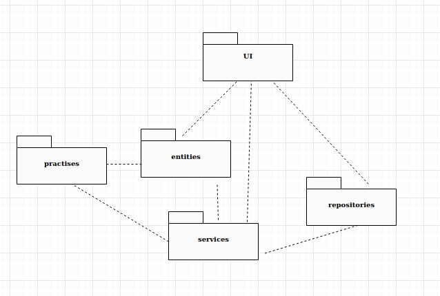
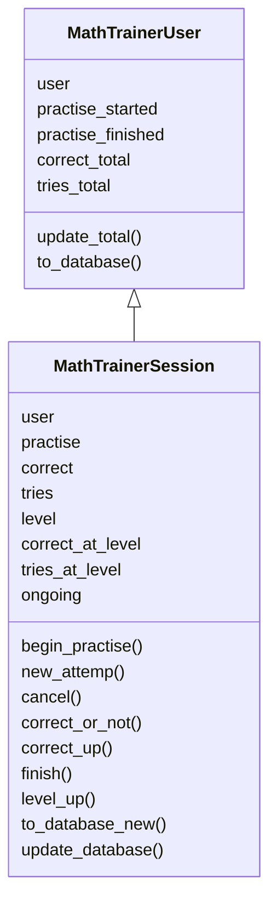
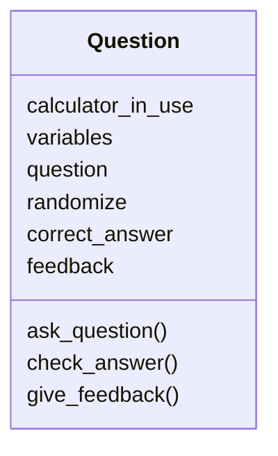
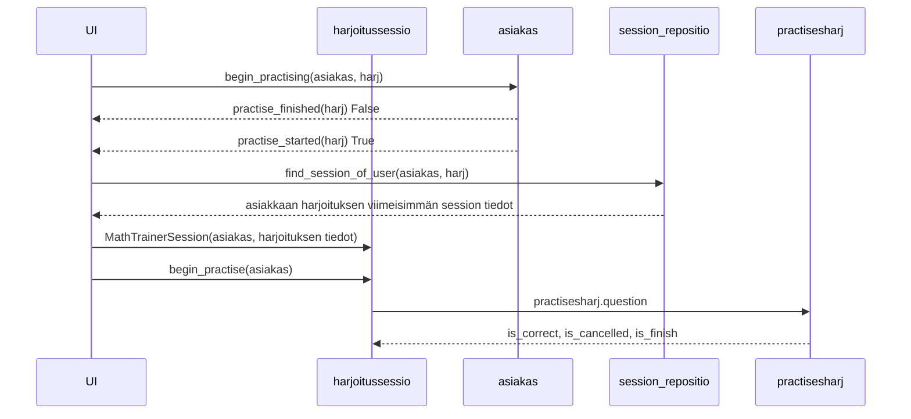

# Arkkitehtuurikuvaus

## Rakenne

Koodin pakkausrakenne on seuraava:

Ohjelman rakenne ei valitettavasti noudata kolmitasoista kerrosarkkitehtuuria ja huomioiden koodin laajuuden ja käytettävissä olevan ajan tätä ei ehdi korjaamaan: Pakkaus UI sisältää käyttöliittymästä vastaavan koodin ja pakkaus repositories tietojen tallennuksesta ja hausta tietokannoista vastaavan koodin. Pakkaus entities sisältää kuitenkin sovelluksen käyttämien luokkien MathTrainerUser, MathTrainerSession ja Question lisäksi sovelluslogiikkaa. Pakkaus services sisältää sekailaisia apuohjelmia. Sovelluksen varsinaisen sisällön määräävät harjoitukset ovat pakkauksessa practises. Uudessa tavassa laatia harjoitus (nyt harjoitus 3) harjoitukseen liittyvät kysymykset ovat omassa pakkauksessa (nyt practises3_questions). Harjoituksiin liittyy sekä käyttöliittymä että sovelluslogiikkaa, eikä niitä ole kunnolla eriytetty toisistaan.

## Käyttöliittymä

Käyttöliittymä sisältää kolme erillistä päänäkymää:
*Kirjautuminen
*Toimenpiteen, erityisesti esimerkiksi harjoituksen, valitseminen
*Toimenpiteen 'ylläpito' valinnalla aukeava valikko tilastotietojen tulostamista varten

Lisäksi jokaista harjoitusta kohden avautuu oma näkymä. (Nyt neljä.)

Tällä hetkellä käyttöliittymä on tekstipohjainen.

## Sovelluslogiikka

Sovelluksessa on usean tasoista sovelluslogiikkaa. Jokaista harjoitusta vastaa oma sovelluslogiikka.

Sovelluksen ytimen loogisen tietomallin muodostavat luokat MathTrainerUser ja MathTrainerSession. Näistä ensimmäinen kuvaa käyttäjää ja hänen tekemiensä harjoitusten kokonaistilannetta. Jälkimmäinen kuvaa käyttäjän tekemän yksittäisen harjoituksen yksittäiseen tasoon liittyviä tietoja (vain oleellisemmat metodit mainittu):

Harjoituksen 3 (joka edustaa tapaa, joka tulee olemaan jatkossa käytössä harjoituksia lisättäessä) sovelluslogiikasta vastaa luokka Question:

Attribuutti question on sanakirja,jonka avaimet ovat 'text', 'prompt' ja 'mode'.
question['text'] on funktio, joka esittää kysymyksen, randomize funktio, joka antaa kysymyksen parametreille arvot, correct_answer funktio, joka laskee parametreistä oikean vastauksen, ja feedback funktio, joka antaa palautteen.

## Tietojen pysyväistallennus

Pakkauksen _repositories_ luokat session_repository ja user_repository huolehtivan luokkien MathTrainerSession ja MathTrainerUser olioiden tietojen tallentamisesta SQLite-tietokantaan.

## Päätoiminnallisuudet

### Uuden käyttäjän luominen ja käyttäjän kirjaantuminen

Sovelluksen käynnistyessä tarkistetaan ensin, ovatko tarvittavat tietokannat olemassa. Jos eivät, sovellus pysähtyy tähän ja käyttäjää pyydetään perehtymään käyttöohjeeseen.

Sovellus pyytää sitten antamaan käyttäjätunnuksen. Jos käyttäjätunnus on jo olemassa, käyttäjä saa viestin

> Rekisteröity käyttäjätunnus.  
> jos et ole itse rekisteröinyt tätä tunnusta,  
> keskeytä ohjelman käyttö päävalikossa X  
> ja kirjaudu uudelleen eri tunnuksella.  

Tässä yhteydessä etsitään myös tietokannasta käyttäjän harjoitustiedot ja välitetään ne käyttäjää kuvaavan luokan MathTrainerUser oliolle. 

Jos käyttäjätunnusta ei ole olemassa, luodaan uusi käyttäjää kuvaavan luokan MathTrainerSession olio.

Kirjautumisen jälkeen aukeaa näkymä, jonka yläosassa ilmoitetaan käyttäjätunnukseen liittyvät tiedot yritysten ja oikeiden vastausten lukumäärästä harjoituksissa, aloitetut harjoituskokonaisuudet ja loppuun tehdyt harjoituskokonaisuudet. Näiden tietojen alla on valikko

> O : Ohje (O-kirjain)  
> X : Lopetus  
> Y : Ylläpito (vaatii salasanan)  
> 1 : Kirjoitettujen lukujen ilmaiseminen numeroilla  
> 2 : Peruslaskutoimitusten harjoittelua kirjoitetuin numeroin  
> 3 : Sanallisia peruslaskuharjoituksia (pari esimerkkiä)  
> 4 : Yhtälön ratkaisun alkeita  

### Harjoituksen tekeminen

Kirjautumisen jälkeen on luotu käyttäjää kuvaava MathTrainerUser luokan olio. Käytetään tälle jatkossa nimitystä trainee.

Tarkastellaan tässä uutta koodaustapaa edustavan harjoituksen 3 tekemistä. Kun käyttäjä valitsee valitsee valikosta tämän harjoituksen, sovellus tarkistaa ensin trainee olion pohjalta, onko käyttäjä jo tehnyt harjoituksen loppuun. Jos on, tästä tulee ilmoitus ja palataan päävalikkoon.

Jos ei ole, edetään. Jos käyttäjä on jo aloittanut harjoituksen
etsitään myös tietokannasta käyttäjän harjoitustiedot ja välitetään viimeisimmän harjoitussessionin tiedot käyttäjää kuvaavan luokan MathTrainerSession oliolle. Jos käyttäjä vasta aloittaa harjoituksen tekemisen, luodaan uusi MathTrainerSession olio. Käytetään jatkossa tälle oliolle nimitystä session.
Jos harjoituskerta on ensimmäinen, päivitetään tämä tieto oliolle trainee. session olion tiedot tallennetaan myös tässä vaiheessa harjoitussesioiden tiedot sisältävään tietokantaan. session oliossa on tieto harjoituksen numerosta.

Tämän jälkeen kutsutaan MathTrainerSession luokan metodia begin_practise, jolle parametriksi annetaan käyttäjätiedot trainee olion välityksellä. Metodi kutsuu ohjelmaa doing_practise, parametriksi annetaan käyttäjän tiedot trainee ja harjoitusta vastaavan koodin sisältävä funktio. 

Ohjelma doing_practise pitää kirjaa harjoitussessionin oikeiden vastausten, yritysten ja peräkkäisten oikeiden vastausten lukumääristä. Ohjelman while-luupissa kutsutaan harjoitusta vastaava funktio, jolle parametrina annetaan peräkkäisten oikeiden vastausten lukumäärä ja menossa oleva harjoituksen taso. Funktio kysyy yhden harjoituksen kysymyksen ja palauttaa tiedon siitä, oliko vastaus oikein, keskeytettiinkö harjoituksen tekeminen ja onko harjoituksen taso tehty loppuun. _Lisättäessä harjoituksia sovellukseen harjoituksen koodin on oltava siis sellainen, että se palauttaa nämä tiedot._ Olion session atribuuttien tiedot päivitetään funktion palauttamien arvojen mukaisesti. Jos harjoitusta tehtäessä se keskeytetään tai siirrytään harjoituksen seuraavalla tasolle, niin olion session tiedot tallennetaan harjoitussesioiden tiedot sisältävään tietokantaan.

Kun harjoituksen kysymyksiin vastaaminen loppuu, olion trainee atribuuttien tiedot päivitetään. Tässä vaiheessa käyttäjää vastaavat tiedot tallennetaan myös käyttäjätiedot sisältävään tietokantaan.

Harjoitusta 3 vastaava funktio kutsuu funktiota question antaen parametreina peräkkäisten oikeiden vastausten lukumäärän ja harjoituksen tason. Funktio question luo uuden luokan Question olion, jonka atribuuttien tiedot määräytyvät kysymyksen sisällöstä. Funktio question palauttaa harjoitusta (3) vastaavalle funktiolle tiedon siitä, oliko vastaus kysymykseen oikein tai väärin tai keskeytettiinkö kysymykseen vastaaminen.

Tapahtumat, kun kirjautunut asiakas: MathTrainerUser on valinnut päävalikosta harjoitukset harj (on luku), jota asiakas ei ole tehnyt loppuun, mutta on aloittanut. 

Kun on tehty yksi harjoituksen harj kysymyksistä, jatko määräytyy sen mukaan, onko vastaus oikein, keskeytettiinkö harjoituksen tekeminen ja (kun vastaus on oikein) tehtiinkö harjoituksen taso loppuun.

## Ohjelman rakenteen ja toimintalogiikan heikkoudet

Harjoitukset 1, 2, ja 4 on toteutettu ensin vanhemmalla ohjelmointitavalla. Harjoitus 3 on tehty uudemmalla ohjelmointitavalla luokkaa Question hyödyntäen. Ohjelmiston ylläpitoa helpottaisi, jos myös
harjoitukset 1, 2, ja 4 olisi toteutettu samalla tavalla kuin harjoitus 3. 

Sovellus ei vaadi tällä hetkellä salasanoja. Todellisessa käytössä ainakin ylläpitotoimintojen, erityisesti käyttäjätunnuksen poistaminen, suorittamisen pitäisi edellyttää salasanaa.

Tällä hetkellä harjoituksessa siirrytään seuraavalla tasolle, kun on vastattu riittävän monta kertaa oikein peräkkäin. Muunlaisiakin siirtymisehtoja voisi olla. Ohjelman rakenne kuitenkin tukee tällä hetkellä vain peräkkäisten oikeiden vastausten lukumäärä -ehdon käyttämistä.

Käyttöliittymä on toistaiseksi tekstipohjainen. Ohjelmiston rakenne pitäisi muuttaa noudattamaan paremmin kolmitasoista kerrosarkkitehtuuria.

    

