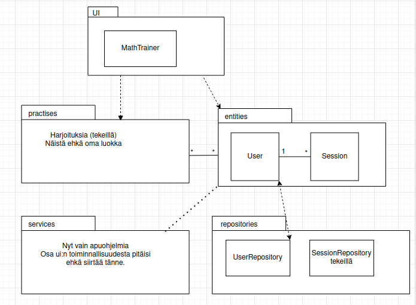
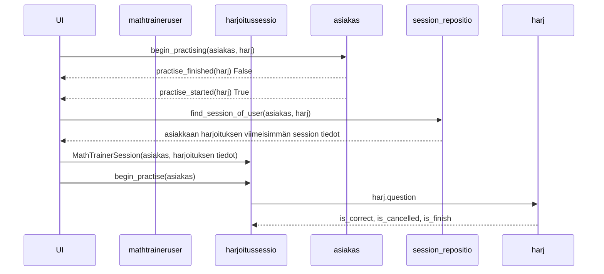

# Arkkitehtuurikuvaus

Tapahtumat, kun kirjautunut asiakas: MathTrainerUser on valinnut päävalikosta harjoitukset harj, jota asiakas ei ole tehnyt loppuun, mutta on aloittanut. 

Kun on tehty yksi harjoituksen harj kysymyksistä, jatko määräytyy sen mukaan, onko vastaus oikein, keskeytettiinkö harjoituksen tekeminen ja (kun vastaus on oikein) tehtiinkö harjoituksen taso loppuun.

    

