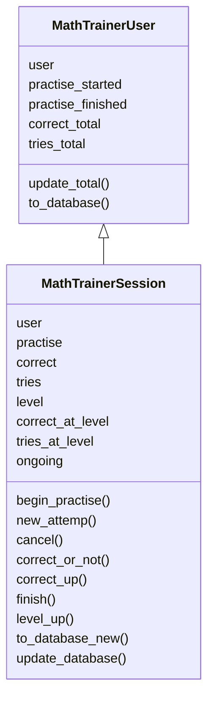

# Arkkitehtuurikuvaus

## Rakenne

Alla oleva kuvio viikon 4 tilasteesta, viikosta 5 lähtien jo joiltain osin vanhentunut

Tähän tulee muutoksia vielä jatkossakin. Kuvaa ei nyt päivitetty. 

Sovelluksen varsinaisen sisällön määräävät harjoitukset ovat pakkauksessa practises. Uudessa tavassa laatia harjoitus (nyt harjoitus 3) harjoitukseen liittyvät kysymykset ovat omassa pakkauksessa (nyt practises3_questions)

## Käyttöliittymä

Käyttöliittymä sisältää kolme erillistä päänäkymää:
*Kirjautuminen
*Toimenpiteen, erityisesti esimerkiksi harjoituksen, valitseminen
*Toimenpiteen 'ylläpito' valinnalla aukeava valikko tilastotietojen tulostamista varten

Lisäksi jokaista harjoitusta kohden avautuu oma näkymä. (Nyt neljä.)

Tällä hetkellä käyttöliittymä on tekstipohjainen.

## Sovelluslogiikka

Sovelluksessa on usean tasoista sovelluslogiikkaa. Jokaista harjoitusta vastaa oma sovelluslogiikka.

Sovelluksen ytimen loogisen tietomallin muodostavat luokat MathTrainerUser ja MathTrainerSession. Näistä ensimmäinen kuvaa käyttäjää ja hänen tekemiensä harjoitusten kokonaistilannetta. Jälkimmäinen kuvaa käyttäjän tekemän yksittäisen harjoituksen yksittäiseen tasoon liittyviä tietoja (vain oleellisemmat metodit mainittu):



Käyttöliittymään suoraan liittyvää luokkaan MathTrainer liittyvää sovelluslogiikkaa ei vielä ole vielä täysin eristetty. Tarkoitus on vielä koodata käyttöliittymä uudelleen graafisena käyttöliittymä ja siinä yhteydessä siirtää sen sovelluslogiikasta vastaava luokka MathTrainer services pakkaukseen.

Harjoituksen 3 (joka edustaa tapaa, joka tulee olemaan jatkossa käytössä harjoituksia lisättäessä) sovelluslogiikasta vastaa luokka Question:

```mermaid
classDiagram   
    class Question{
      calculator_in_use
      variables
      question
      randomize
      correct_answer
      feedback
      ask_question()
      check_answer()
      give_feedback()
    }
´´´

Attribuutti question on sanakirja,jonka avaimet ovat 'text', 'prompt' ja 'mode'.
question['text'] on funktio, joka esittää kysymyksen, randomize funktio, joka antaa kysymyksen parametreille arvot, correct_answer funktio, joka laskee parametreistä oiekan vastauksen, ja feedback funktio, joka antaa palautteen.


## Tietojen pysyväistallennus

Pakkauksen _repositories_ luokat session_repository ja user_repository huolehtivan luokkien MathTrainerSession ja MathTrainerUser olioiden tietojen tallentamisesta SQLite-tietokantaan.

## Päätoiminnallisuudet

### Harjoituksen valitseminen

Tapahtumat, kun kirjautunut asiakas: MathTrainerUser on valinnut päävalikosta harjoitukset harj (on luku), jota asiakas ei ole tehnyt loppuun, mutta on aloittanut. 

```mermaid
    sequenceDiagram
    participant UI
    participant mathtraineruser
    participant harjoitussessio   
    UI ->> asiakas: begin_practising(asiakas, harj)
    asiakas -->> UI: practise_finished(harj) False
    asiakas -->> UI: practise_started(harj) True
    UI ->> session_repositio: find_session_of_user(asiakas, harj)
    session_repositio -->> UI: asiakkaan harjoituksen viimeisimmän session tiedot 
    UI ->> harjoitussessio: MathTrainerSession(asiakas, harjoituksen tiedot)
    UI ->> harjoitussessio: begin_practise(asiakas)
    harjoitussessio ->> practisesharj: practisesharj.question
    practisesharj -->> harjoitussessio: is_correct, is_cancelled, is_finish
´´´
Kun on tehty yksi harjoituksen harj kysymyksistä, jatko määräytyy sen mukaan, onko vastaus oikein, keskeytettiinkö harjoituksen tekeminen ja (kun vastaus on oikein) tehtiinkö harjoituksen taso loppuun.

## Ohjelman rakenteen heikkoudet

Harjoitukset 1, 2, ja 4 on toteutettu ensin vanhemmalla ohjelmointitavalla. Harjoitus 3 on tehty uudemmalla ohjelmointitavalla luokkaa Question hyödyntäen. Ohjelmiston ylläpitoa helpottaisi, jos myös
harjoitusket 1, 2, ja 4 olisi toteutettu samalla tavalla kuin harjoitus 3. 

Käyttöliittymä on toistaiseksi tekstipohjainen.


    


