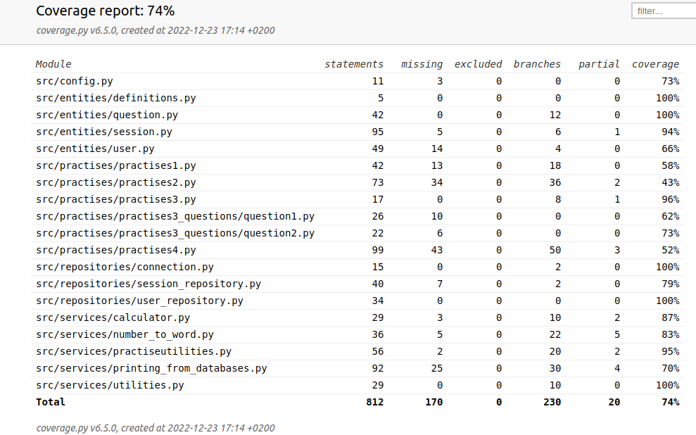

# Testausdokumentti

Ohjelmaa on testattu sekä automatisoiduin yksikkötestein unittestilla että manuaalisesti järjestelmätason testeihin.

Testin suorittaja ei ollut oikein perillä siitä, mitä automaattisilla integraatiotesteillä tarkoitetaan, eikä niitä ehkä tästä syystä ole tehty. Yksikkötesteissä on kuitenkin testattu eri luokkien yhteistoimintaa niin, että on koodattu apufunktio, joka palauttaa samantyyppisiä arvoja kuin mitä toinen luokka tai aliohjelman palauttaisi testattavalle luokalle, ja testattu sitä hyödyntäen luokkaa, jolle kyseiset parametrit välitetään.

## Yksikkötestaus

### Sovelluslogiikka

Sovellus tallentaa tietokantoihin tiedot MathTrainerUser ja MathTrainerSession luokkien olioden välityksellä. Sovelluslogiikan testauksessa on tyydytty testaamaan sitä, että tiedot siirtyvät oikein näiden luokkien olioiden attribuuteiksi.

Sovelluslogiikasta on testattu myös luokkaa Question, joka välittää parametrien arvoja edellä mainituille luokille.

### Repositorio-luokat

Repositorio-luokkia ja tietokannoista tulostamisessa käytettyä PrintingService luokkaa on automaattisesti testattu testeissä käytössä olevilla kahdella tietokannalla, joiden nimet on konfiguroitu .env.test -tiedostoon. Manuaalisessa testauksessa on käytetty sovelluksen käyttämiä tietokantoja, joiden nimet on konfiguroitu .env -tiedostoon.

### Testauskattavuus

Testaamisen ulkopuolelle on jätetty .coveragerc tiedoston rivin

> omit = src/**/__init__.py,src/tests/**,src/ui/**,src/index.py, src/build.py, src/initialize_databases.py

mukaiset tiedostot.

## Järjestelmätestaus

Järjestelmätestaus on suoritettu manuaalisesti.

### Asennus ja konfigurointi

Sovellus on haettu ja sitä on testattu käyttöohjeen kuvaamalla tavalla Linux-ympäristössä.

Testauksessa on käytetty vain .env-tiedostossa olevaa konfigurointia.

Sovellusta on testattu tilanteissa, joissa sovelluksen käyttämät kaksi tietokantaa ovat olleet jo olemassa, ja tilanteissa, joissa ne on luotu build-komennolla. Myös virhetapaus, jossa tietokantoja ei ole muodostettu, on testattu.

### Toiminnallisuudet

Määrittelydokumentin listaamat toiminnallisuudet on käyty läpi. Myös sovelluksen neljä eri harjoitusta on käyty loppuun, mutta testauksen nopeuttamiseksi koodissa on määritelty, että kaksi peräkkäistä vastausta riittää siihen, että siirrytään harjoituksessa seuraavalle tasolle. (Harjoituksessa 3 yksi oikea riittää.)

Sovelluksen koodi on laadittu niin, että syöte, jolla ei ole vaikutusta sovelluksen kulkuun (esimerkiksi tyhjä syöte), keskeyttää meneillään olevan toimenpiteen tai sovellus kysyy syötettä uudelleen. Tätä on sovelluksen kehittelyvaiheissa testattu.

### Sovellukseen jääneet laatuongelmat

Sovelluksen pakkausrakenne ei noudata suoraviivaisesti kolmitasoista kerrosarkkitehtuuria.

Sovelluksen ongelma on se, että osa harjoituksista (harjoitukset 1, 2, ja 4) on toteutettu eri tyylillä kuin uudempi harjoitus 3, eikä aikaa ollut muokata näitä harjoituksia harjoituksen 3 rakennetta vastaaviksi. Kun tämä muokkaus on tehty, osa apuohjelmista tulee tarpeettomiksi ja ohjelman rakenne selkiytyy.

Valmiin sovelluksen tarkoitetun kohdeyleisön huomioiden sovelluksen käyttöliittymä sekä pääohjelmassa että erityisesti harjoitusten suorittamisessa käytettävä käyttöliittymä on syytä muuttaa graafiseksi. Aikaa tähän ei nyt ollut.

